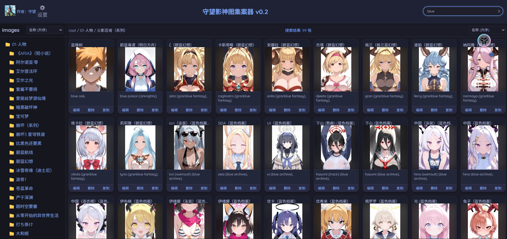
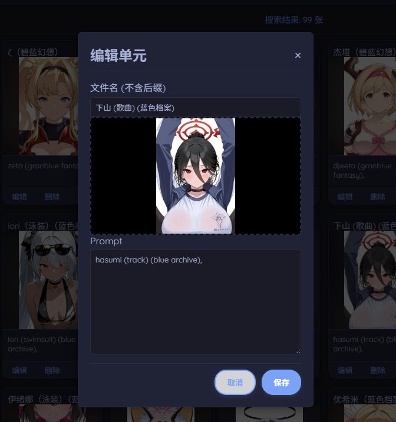

<div align="center"> 
 
<h1 style="color: #66CD6B; margin: 0;">守望影神图集案器</h1> 
<h3 style="color: #79DAFE; font-weight: normal; line-height: 1.5; margin: 10px 0 0 0;"> 
一个基于 Python Flask 的本地图集管理工具，专为管理 AI 绘画作品（Stable Diffusion-NovelAI）和 Prompt 提示词而设计。
</h3>
</div>


  






## 🚀 快速开始 (Quick Start)

### 环境要求

*   Python 3.8 或更高版本
*   Windows / Mac / Linux

### 1. 安装依赖

```python
pip install -r requirements.txt
```

### 2. 启动应用
**Windows 用户 (推荐)**：
直接双击根目录下的 **`一键启动.bat`**。
*会自动启动服务器并打开默认浏览器。*

**通用方式**：
```python
python app.py
```
默认访问地址：`http://127.0.0.1:5000`

## 📁 项目结构

```text
/
├── app.py              # Flask 后端主程序
├── requirements.txt    # 依赖列表
├── 一键启动.bat        # Windows 快捷启动脚本
├── static/             
│   ├── css/style.css   # 核心样式表 (包含双主题定义)
│   ├── js/script.js    # 前端逻辑 (Fetch API, 交互)
│   └── img/            # 背景素材
└── templates/
    └── index.html      # 主页面结构
```

## 👤 作者

**守望**
[Bilibili 主页](https://space.bilibili.com/1284158907)

---
*Created with ❤️ by Shouwang & AI Assistant*

### 数据来源感谢

​	[lanner0403/WAI-NSFW-illustrious-character-select: WAI-NSFW-illustrious 角色選擇器](https://github.com/lanner0403/WAI-NSFW-illustrious-character-select)

本项目采用 [Apache License 2.0](LICENSE) 开源许可证。	
